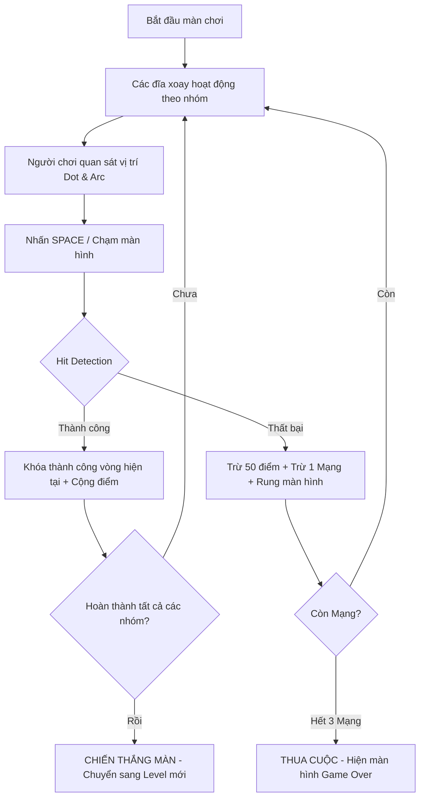

# ⚡ ORBIT UNLOCKER & FRUIT PARADISE 🍉
> **Hệ Thống Game Giải Mã Đĩa Xoay Đồng Tâm & Thu Hoạch Trái Cây Đa Nền Tảng (HTML5 Canvas)**

---

## 🌟 1. GIỚI THIỆU DỰ ÁN (PROJECT OVERVIEW)

**Orbit Unlocker** (và Chế độ mở rộng **Fruit Paradise**) là trò chơi Arcade / Lockpicking phản xạ thời gian thực được xây dựng bằng công nghệ thuần **HTML5 Canvas** và **Vanilla JavaScript (ES6+)**. 

Trò chơi lấy cảm hứng từ cơ chế phá khóa điện tử trong các tựa game Sci-Fi bom tấn, nơi người người chơi cần căn thời gian chính xác tuyệt đối khi các đĩa xoay đồng tâm mang điểm màu hoặc hoa quả di chuyển với tốc độ biến thiên.

---

## ⚡ 2. CÁC TÍNH NĂNG NỔI BẬT (KEY FEATURES)

### 🎨 2 Chế Độ Chơi & Giao Diện Sắc Nét (Dual Themes)
- **⚡ Cyber Lockpick Mode**: Giao diện Neon Cyberpunk huyền bí với hiệu ứng phát sáng mượt mà, âm thanh chuẩn điện tử Sci-Fi.
- **🍉 Fruit Paradise Mode**: Giao diện Nhiệt đới rực rỡ với các icon trái cây tách nền trong suốt (**Dâu, Nho, Thơm, Đào**), âm thanh thu hoạch vui nhộn.

### 🔄 Cơ Chế Chơi Đa Dạng & Sáng Tạo
- **Tiến trình Từ Trong Ra Ngoài**: Mở các vòng đồng tâm từ bán kính nhỏ nhất ra đến ngoài cùng.
- **Xoay Đồng Thời Nhóm Vòng (Simultaneous Rotation)**: Yêu cầu căn nhịp khớp 2 vòng liên tiếp, 2 vòng không liên tiếp hoặc **tất cả 6 vòng đồng thời** trong cùng 1 lần bấm.
- **Cơ Chế Vòng Khuyết Bật Ngược (Partial Oscillating Ring)**: Vòng không khép kín 360° mà nảy qua nảy lại giữa 2 nút chặn mốc biên (Ping-pong bounce).

### 📱 Giao Diện 100dvh Zero-Scroll Tối Ưu Cho Điện Thoại & Máy Tính
- **Responsive Hoàn Hảo**: Cố định 100dvh vừa khít mọi kích thước màn hình (iPhone, Android, PC, Laptop), không sinh ra thanh cuộn trang.
- **High-DPI Retina Scaling**: Tự động co giãn đĩa xoay theo tỉ lệ `aspect-ratio: 1 / 1` nhưng giữ độ nét 60fps trên màn hình Retina.
- **Điều Khiển Đa Nền Tảng**: Hỗ trợ bấm phím `SPACE` / `ENTER` trên máy tính hoặc **chạm trực tiếp màn hình / nút bấm** trên di động với phản hồi tức thì (`0ms delay`).

### 🏆 Hệ Thống Người Chơi & Bảng Kỷ Lục
- **Quản lý Hồ Sơ Người Chơi (Player Manager)**: Đăng ký tên mới hoặc chọn người chơi cũ từ danh sách dropdown.
- **Lưu Trữ Kỷ Lục (`localStorage`)**: Lưu trữ điểm cao nhất, cấp độ đạt được và hiển thị Bảng Vàng Kỷ Lục (Leaderboard) chuyên nghiệp.

### ❤️ Hệ Thống 3 Mạng & Phạt Điểm
- **3 Mạng Sống (`❤️❤️❤️`)**: Mỗi lần nhấn sai bị trừ 50 điểm và mất 1 mạng. Nhấn sai quá 3 lần sẽ dẫn tới màn hình **THUA CUỘC (Game Over)**.

---

## 🎮 3. CƠ CHẾ VẬN HÀNH & QUY TẮC TOÁN HỌC (GAME MECHANICS)

### 3.1 Core Loop (Vòng lặp cốt lõi)


### 3.2 Quy Tắc Toán Học & Va Chạm (Trigonometry & Hit Detection)
- **Hệ tọa độ Cực $\rightarrow$ Đề-các (Polar to Cartesian)**:
  $$x = cx + r \cdot \cos(\theta)$$
  $$y = cy + r \cdot \sin(\theta)$$
- **Tọa độ thực tế của Điểm màu**:
  $$\theta_{\text{global}} = (\theta_{\text{ring}} + \theta_{\text{offset}}) \pmod{360^\circ}$$
- **Kiểm tra va chạm chuẩn xác Mốc $0^\circ / 360^\circ$ (Wrap-Around Hit)**:
  Đoạn cong (Arc) bắt đầu tại $\alpha$ với độ rộng $W$. Va chạm hợp lệ khi:
  $$\text{Target} \le \theta_{\text{global}} + \text{Tolerance} \quad \text{và} \quad \theta_{\text{global}} - \text{Tolerance} \le \text{Target} + W$$

---

## 🗺️ 4. TIẾN TRÌNH 10 MÀN CHƠI (10-LEVEL ROADMAP)

| Level | Tên Màn Chơi | Loại Vòng Xoay | Tốc Độ | Đặc Điểm & Cơ Chế Nổi Bật |
| :---: | :--- | :---: | :---: | :--- |
| **1** | Màn 1: Căn Giờ Cơ Bản | Đơn lẻ (1 vòng/lượt) | Chậm | 2 Vòng 360°, Arc rộng $80^\circ$, 1 màu. |
| **2** | Màn 2: 3 Vòng Đơn Lẻ | Đơn lẻ (1 vòng/lượt) | Vừa | 3 Vòng 360°, 2 Màu/Quả đối xứng. |
| **3** | Màn 3: 2 Vòng Liên Tiếp | Đồng thời `[[0,1], [2]]` | Vừa | 2 vòng trong cùng xoay cùng lúc. |
| **4** | Màn 4: 2 Vòng Xem Kẽ | Đồng thời `[[0,2], [1,3]]` | Nhanh vừa | 2 vòng không liên tiếp xoay cùng lúc. |
| **5** | Màn 5: Tập Vòng Khuyết | Đơn lẻ | Chậm | **Tập làm quen Vòng Khuyết dội ngược** ($45^\circ \rightarrow 315^\circ$). Arc rất rộng. |
| **6** | Màn 6: Đa Vòng Khuyết | Đơn lẻ | Vừa | Nhiều Vòng Khuyết dội ngược (mỗi vòng khuyết 1 màu duy nhất). |
| **7** | Màn 7: Song Vòng Khuyết | Đồng thời `[[0,1], [2,3]]` | Nhanh vừa | Kết hợp 2 vòng xoay đồng thời với Vòng Khuyết. |
| **8** | Màn 8: Kết Hợp 5 Vòng | Đồng thời `[[0,2,4], [1,3]]` | Nhanh | 3 vòng xoay đồng thời kết hợp Vòng Khuyết 1 màu. |
| **9** | Màn 9: Thần Trận 5 Vòng | Đồng thời `[[0,2,4], [1,3]]` | Rất nhanh | Màn thử thách tốc độ cao với 5 vòng xoay 360° liên hoàn. |
| **10**| Màn 10: Thần Trận Vô Địch | Đồng thời `[[0,1,2,3,4,5]]` | Siêu tốc | **CỰC KHÓ! Tất cả 6 vòng xoay đồng thời**, đầy đủ Vòng Khuyết, 4 Màu/Quả, Arc $25^\circ$. |

---

## 🛠️ 5. CẤU TRÚC KIẾN TRÚC MÃ NGUỒN (TECH STACK & CODEBASE)

### Công nghệ sử dụng:
- **Ngôn ngữ**: Pure Vanilla JavaScript (ES6+ Class OOP).
- **Đồ họa**: HTML5 Canvas 2D Context API.
- **Âm thanh**: Web Audio API Synthesizer (tự tổng hợp âm thanh không phụ thuộc file audio bên ngoài).
- **Styling**: CSS3 Modern Design Tokens, Flexbox, Glassmorphism, Google Fonts (`Orbitron`, `Rajdhani`).

### Cấu trúc thư mục dự án:
```text
orbit-unlocker/
├── index.html              # Cấu trúc HTML5 chứa Canvas, HUD và các Cửa sổ Modal
├── Overview.md             # Tài liệu giới thiệu tổng quan dự án (File này)
├── css/
│   └── style.css           # Design Tokens, Layout 100dvh & Style Responsive Mobile/PC
├── js/
│   ├── config.js           # Cấu hình hằng số game & Thông số 10 Level (Cyber & Fruit)
│   ├── utils.js            # Các hàm toán học, đổi tọa độ Cực, kiểm tra va chạm góc
│   ├── Audio.js            # Trình tổng hợp âm thanh Web Audio API (Click, Win, Fail, Error)
│   ├── ImageLoader.js      # Trình Preload tài nguyên ảnh trái cây PNG tách nền
│   ├── PlayerManager.js     # Quản lý hồ sơ người chơi & Lưu trữ Bảng Kỷ Lục localStorage
│   ├── GameManager.js      # Máy trạng thái chính (State Machine), xử lý mạng sống & HUD
│   ├── main.js             # Entry Point, resize canvas Retina & Game Loop 60fps
│   └── entities/
│       ├── Ring.js         # Entity Đĩa xoay đồng tâm & Logic Vòng Khuyết dội ngược
│       ├── Arc.js          # Entity Khay màu đích / Khay trái cây
│       └── Dot.js          # Entity Điểm màu Neon / Icon Trái cây tách nền
└── js/Icon/Fruits/         # Thư mục chứa 4 ảnh trái cây PNG tách nền trong suốt
    ├── Dâu.png
    ├── Nho.png
    ├── Thơm.png
    └── Đào.png
```

---

## 🌐 6. HƯỚNG DẪN ĐĂNG WEB & CHIA SẺ (DEPLOYMENT)

### Cách 1: Đăng nhanh qua Netlify Drop (Không cần gõ code)
1. Truy cập: **[app.netlify.com/drop](https://app.netlify.com/drop)**
2. Kéo cả thư mục dự án `orbit-unlocker` thả vào trang web.
3. Nhận đường link web công khai để gửi cho bạn bè chơi ngay lập tức!

### Cách 2: Đăng qua GitHub Pages (Đường link chuẩn vĩnh viễn)
```bash
git add .
git commit -m "Initial commit Orbit Unlocker project"
git push origin main
```
Trang web sẽ tự động chạy tại: **`https://vothang4105.github.io/Orbit-unlocker/`**

---

## 📜 7. BẢN QUYỀN (LICENSE)

Dự án được phát triển dưới bản quyền open-source **MIT License**. Bạn có thể tự do trải nghiệm, tùy chỉnh và phát triển thêm các chế độ chơi mới!
